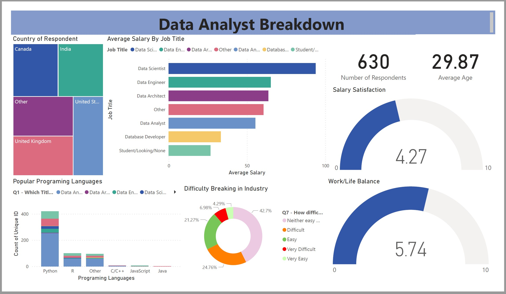

<link rel="stylesheet" href="https://cdn.jsdelivr.net/gh/devicons/devicon@v2.15.1/devicon.min.css">
          
# Data Analyst Survey Analysis

---
Data dashboard based ona survey presented to Data Analysts in different stages of career development. The survey considers variables such as:
- Field, industry or sector of employment
- Job satisfaction
- Salary Range
- Location
- Preferred Programming Language
- Salary Satisfaction
Findings can be used by employers and individuals to make informed decisions about hiring, career growth, and workplace satisfaction.

## Languages and Tools

&nbsp;
&nbsp;

## Dashboard

&nbsp;

## Data
- Data sources can be found in the **'data-src'** Folder